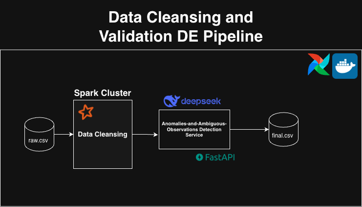

# Network-Inventory-Cleaning-and-Validation README

## Description

The purpose of this containerized pipeline is to cleanse and validate the observations stored in the inventory_raw.csv provided, solve its ambiguous cases and detect its anomalies –via a deepseek-api-powered FastAPI server– and export the results as inventory_clean.csv.

## Architecture Visualized



## To Run Pipeline

- Clone repository.

- Run docker-compose:

  - ```docker compose up -d --build```

- Once all the containers have started, execute the *inventory_pipeline* DAG found in ```localhost:8080```

  - username: admin
  - password: admin

- The results should be found in the directory *output/{date_of_execution}*

# Approach

Our pipeline is divided into four tasks and are all executed one after the other through an airflow DAG. The tasks execute in the following order:

```ingest_and_transform_inventory >>> llm_transform_owner >>> detect_anomalies >>> load_inventory```

Description of tasks:

- ```ingest_and_transform_inventory```: Ingests the *raw_inventory.csv* and applies deterministic transformations –e.g. validate ip, mac, etc– whose logic can be found in *src/clean_inventory.py*. The results are exported to *tmp/01-ingest-and-transform-inventory/{date_of_execution}_inventory_tmp.csv*.
- ```llm_transform_owner```: Transforms the ambiguous cases of the owner classes –owner, owner_team, and owner_email– using our deepseek-api-powered fastapi server. The results are first exported in a .json format in *tmp/02-llm-owner-transform/json_response/{date_of_execution}_response.json*, then they are set inside of our .csv, which is similarly found in *tmp/02-llm-owner-trasnform/{date_of_execution}_inventory_tmp.csv*.
- ```detect_anomalies```: Uses our deepseek-api-powered server to determine which observations are anomalies. The results can be found in *outputs/{date_of_exectution}/anomalies.json*.
- ```load_inventory```: Exports the final clean inventory to *outputs/{date_of_execution}/clean_inventory.csv*.

# Prompts

- System prompt:
```
You are a helpful assistant. Do not answer with more words than you need;
when a user asks you something you do it as exact as possible.
```

- For ambiguous owner transformations:
```
I want you to exclusively look at the owner, owner_team, and owner_email per each observation in the attached .json file". Return to me how you think they should be parsed, regardless of whether you agree with the original parsing or not, and return your parsing in a .json file. That is, if you think the owner value in an observation should be swapped with the value in owner_team, swap them. 
  
Consider taking into account that the name of teams (ops, platform, facilities, etc.) should be in the owner_team column, and only peoples' names should be in the owner column.
  
Additionally, include a new column of your confidence_percentage (from 0 to 100%) that these changes are correct. I only would like the .json from you (no need to explain your reasoning).
  
If you think that an observation doesn't require any changing, that's fine, too.
  
Note: If you think a value is null, just put null; don't change the format.

EXAMPLE JSON OUTPUT: {
    "owner": {
        "0": "juan",
        ...,
        "10": null,
        ...
    },
    "owner_team": {
        "0": "marketing",
        ...,
        "14": null
    },
    "owner_email":{
        "0": "juan@example.com"
        ...
    },
    "confidence_percentage":{
        "0": 75,
        ...
    }
}
```

- For detecting anomalies:
```
I want you to exclusively look at each observation in the attached .json file" .
Return to me which rows you think are anomalies; return your results in a .json file.

In the .json file that you return each row of interest should have the following classes: source_row_id (this is determined by the source_row_id class of each observation), affected_fields (these are determined by which classes you think make that specific observation an anomaly), issue_type (what you think is the issue with respects to each affected_field), recommended_action (this should be a binary value, either "modify" or "drop"), and anomaly_confidence (from 0 to 100 how sure you are that the observation is an anomaly) 

EXAMPLE JSON OUTPUT: {
    "source_row_id": 0,
    "affected_fields": [ip_valid, mac_valid, reverse_ptr, fqdn, device_type],
    "issue_type": "ip is invalid, mac is invalid, reverse_ptr does not exist, fqdn does not exist, and device_type is not listed. The combination of all of these make this an anomaly.",
    "recommended_action": "drop",
    "anomaly_confidence": 75
}, 
...,
{
    "source_row_id": 10,
    ...,
    "recommended_action": "modify",
    "anomaly_confidence": 100
}
```


# Cons

Some of the cons of the current pipeline that come to mind:

- All running locally on a single machine. We're not leveraging distributed processing, or storage, systems –e.g. Spark, S3, etc.
- LLM-powered transformation are not deterministic; to mitiage this the temperature has been set and the LLM is asked to provide a confidence rating for every each change that it makes; we only apply the changes to the ratings that are sitting higher than a threshold. However, due to its non-deterministic nature, the ratings are also volatile. 
- Deterministic transformations do not include ipv6 cases. 
